# Sistema de Monitoreo de Temperatura - Invernadero

Sistema de monitoreo de temperatura para invernadero usando ESP32, sensor LM35, LEDs indicadores y botones de control.

## Autores

Miguel Angel Luna Garcia
Gustavo Adolfo Quintero

## Pinout ESP32

| Componente | Pin ESP32 | Descripción |
|------------|-----------|-------------|
| LED Verde | GPIO 25 | Temperatura baja (≤25°C) |
| LED Amarillo | GPIO 26 | Temperatura óptima (26-49°C) |
| LED Rojo | GPIO 27 | Temperatura alta (≥50°C) |
| Botón 1 | GPIO 14 | Registrar medición (Pull-Down) |
| Botón 2 | GPIO 12 | Finalizar sistema (Pull-Down) |
| LM35 | GPIO 34 (ADC1_CH6) | Sensor de temperatura |
| DAC/Buzzer | GPIO 26 (DAC2) | Señal de aviso |

## Conversión ADC → Voltios → °C

El ESP32 usa un ADC de 12 bits (0-4095 cuentas) con Vref = 3.3V:

```
Voltios = (cuentasADC / 4095) × 3.3V
Temperatura (°C) = Voltios / 0.01   (LM35: 10mV/°C)
```

**Ejemplo:**
- 25°C → 0.25V → 310 cuentas
- 50°C → 0.50V → 620 cuentas

## Modos de Operación

### Modo Sensor Real
El sistema lee directamente del LM35 conectado al pin ADC.

### Modo Simulación
Se activa enviando comandos por Serial.

## Comandos Serial

| Comando | Descripción | Ejemplo |
|---------|-------------|---------|
| `T=<valor>` | Simular temperatura | `T=32.5` |
| `B1=1` | Simular presión Botón 1 | `B1=1` |
| `B2=1` | Simular presión Botón 2 | `B2=1` |

## Diagrama de Flujo del Sistema


## Funcionamiento

### Control de LEDs (Umbrales)
- **T ≤ 25°C**: LED Verde → "Temperatura baja. Activando calefacción."
- **26°C ≤ T ≤ 49°C**: LED Amarillo → "Temperatura óptima. Sistema en espera."
- **T ≥ 50°C**: LED Rojo → "Temperatura alta. Desactivando calefacción."

### Botón 1 (Registro de mediciones)
-   Al presionarse, toma automáticamente 5 muestras consecutivas
- Muestra cada muestra individual en el monitor serial
- Calcula y muestra el promedio de las 5 mediciones
- Espera 500ms entre cada muestra para mayor precisión
- Incluye antirrebote por software (50ms)

### Botón 2 (Finalización)
- Muestra el promedio total de todas las mediciones
- Genera señal de aviso por DAC (3 pulsos de 200ms)
- Apaga todos los LEDs
- Finaliza el sistema

## Diagrama de Conexiones

```mermaid
graph LR
    subgraph ESP32["ESP32 Dev Module"]
        GPIO25["GPIO 25"]
        GPIO26["GPIO 26"]
        GPIO27["GPIO 27"]
        GPIO14["GPIO 14"]
        GPIO12["GPIO 12"]
        GPIO34["GPIO 34<br/>(ADC1_CH6)"]
        VCC["3.3V"]
        GND["GND"]
    end
    
    subgraph LEDs["Indicadores LED"]
        LEDV["LED Verde<br/>220Ω"]
        LEDA["LED Amarillo<br/>220Ω"]
        LEDR["LED Rojo<br/>220Ω"]
    end
    
    subgraph Botones["Controles"]
        B1["Botón 1<br/>+10kΩ Pull-Down"]
        B2["Botón 2<br/>+10kΩ Pull-Down"]
    end
    
    subgraph Sensores["Sensores"]
        LM35["LM35<br/>Sensor Temp"]
        BUZZ["Buzzer<br/>Pasivo"]
    end
    
    GPIO25 --> LEDV
    GPIO26 --> LEDA
    GPIO26 --> BUZZ
    GPIO27 --> LEDR
    LEDV --> GND
    LEDA --> GND
    LEDR --> GND
    BUZZ --> GND
    
    GPIO14 --> B1
    B1 --> VCC
    B1 --> GND
    
    GPIO12 --> B2
    B2 --> VCC
    B2 --> GND
    
    VCC --> LM35
    LM35 --> GPIO34
    LM35 --> GND
    
    style ESP32 fill:#e1f5ff
    style LEDs fill:#fff3e0
    style Botones fill:#f3e5f5
    style Sensores fill:#e8f5e9
```



## Conexiones Eléctricas

### LM35
```
LM35 Pin 1 (Vcc) → 3.3V ESP32
LM35 Pin 2 (Vout) → GPIO 34 (ADC1_CH6)
LM35 Pin 3 (GND) → GND ESP32
```

### Botones (Pull-Down)
```
Botón 1: GPIO 14 → Botón → 3.3V
         GPIO 14 → Resistencia 10kΩ → GND

Botón 2: GPIO 12 → Botón → 3.3V
         GPIO 12 → Resistencia 10kΩ → GND
```

### LEDs
```
GPIO 25 → Resistencia 220Ω → LED Verde → GND
GPIO 26 → Resistencia 220Ω → LED Amarillo → GND
GPIO 27 → Resistencia 220Ω → LED Rojo → GND
```

### DAC/Buzzer
```
GPIO 26 (DAC2) → Buzzer pasivo → GND
```

## Simulación Online

Puedes probar el proyecto directamente en tu navegador sin necesidad de hardware:

🔗 **[Abrir simulación en Wokwi](https://wokwi.com/projects/447462154562945025)**

La simulación incluye:
- ESP32 con todos los componentes conectados
- Sensor LM35 con temperatura ajustable
- LEDs indicadores y buzzer
- Monitor serial para comandos y visualización

## Compilación y Carga

1. Abrir `codigo.ino` en Arduino IDE
2. Seleccionar placa: **ESP32 Dev Module**
3. Seleccionar puerto COM correspondiente
4. Compilar y cargar
5. Abrir Monitor Serial a 115200 baudios

## Pruebas

### Prueba con Sensor Real
1. Conectar LM35 al ESP32
2. Cargar el código
3. El sistema leerá automáticamente del sensor

### Prueba con Simulación
1. Abrir Monitor Serial
2. Enviar: `T=28` → LED Amarillo
3. Enviar: `B1=1` → Toma 5 muestras automáticamente y muestra el promedio
4. Enviar: `B2=1` → Finalizar sistema

Parcial II - Microcontroladores I
